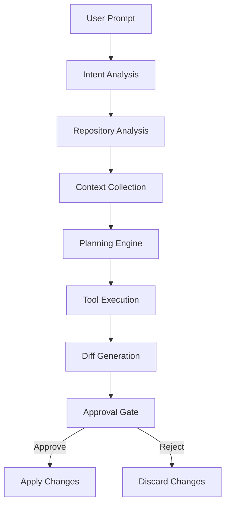
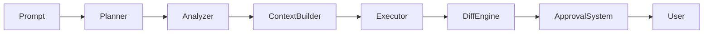
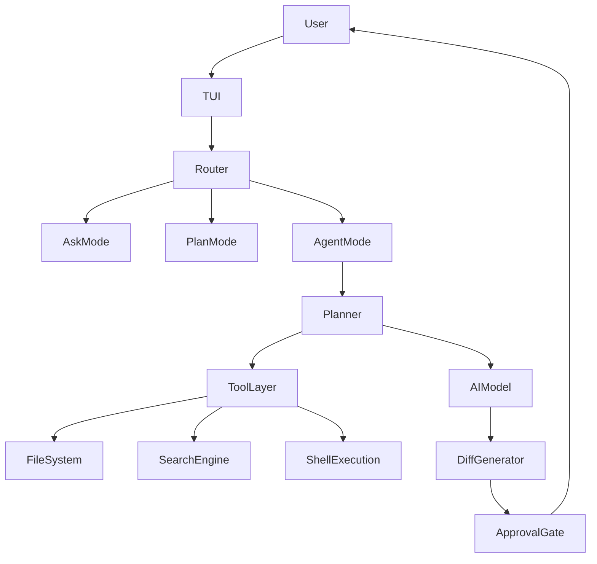

# 🎅 SantaClaw

<div align="center">

### Your AI-Powered Terminal Engineer

**Ask questions. Generate plans. Build features. Review every change. Stay in control.**

SantaClaw is an approval-first AI coding assistant built for developers who want the power of autonomous agents without surrendering control of their codebase.

Unlike many AI coding tools that directly modify files, SantaClaw stages every proposed change and lets you review, approve, or reject modifications before they are applied.

Built with **Bun**, **TypeScript**, **AI SDK**, and a modular tool architecture.

---


[](https://hub.docker.com/r/sahilsingh94/santaclaw)

</div>

---
## Quick Start

## Docker Deployment

### Pull Image

```bash
docker pull sahilsingh94/santaclaw:latest
```

### Run Container

```bash
docker run -it \
-e OPENROUTER_API_KEY=your_key \
-e TELEGRAM_BOT_TOKEN=your_token \
-e FIRECRAWL_API_KEY=your_key \
sahilsingh94/santaclaw:latest
```

### Using an Environment File

Create a `.env` file:

```env
OPENROUTER_API_KEY=your_key
TELEGRAM_BOT_TOKEN=your_token
FIRECRAWL_API_KEY=your_key
```

Run:

```bash
docker run -it --env-file .env sahilsingh94/santaclaw:latest
```

### Docker Compose

```yaml
services:
  santaclaw:
    image: sahilsingh94/santaclaw:latest
    env_file:
      - .env
    restart: unless-stopped
```

Start:

```bash
docker compose up -d
```

### Build From Source

```bash
git clone https://github.com/<your-username>/SANTACLAW.git

cd SANTACLAW

docker build -t santaclaw .
```

Run:

```bash
docker run -it --env-file .env santaclaw
```

### Required Environment Variables

| Variable           | Required | Description             |
| ------------------ | -------- | ----------------------- |
| OPENROUTER_API_KEY | Yes      | LLM access              |
| TELEGRAM_BOT_TOKEN | Optional | Telegram mode           |
| FIRECRAWL_API_KEY  | Optional | Web search and crawling |

### Troubleshooting

View logs:

```bash
docker logs <container-id>
```

List running containers:

```bash
docker ps
```

Verify environment variables:

```bash
docker exec -it <container-id> env
```

---

# ✨ Features

## 🤖 Autonomous Agent Mode

A fully autonomous coding agent capable of:

* Understanding repository structure
* Exploring project architecture
* Searching and analyzing codebases
* Creating new files
* Modifying existing files
* Refactoring code
* Removing obsolete code
* Generating implementation plans
* Executing multi-step development workflows

Every modification is staged before application.

---

## 💡 Ask Mode

Ask questions about:

* Your codebase
* Programming concepts
* System design
* Architecture decisions
* Performance bottlenecks
* Debugging issues
* Framework-specific problems
* Best practices

SantaClaw analyzes project context before answering.

---

## 📋 Plan Mode

Generate implementation plans before writing code.

Ideal for:

* New features
* Refactors
* Database migrations
* API design
* Microservice architecture
* Project roadmaps
* Learning unfamiliar codebases

---

## 📱 Telegram Mode

Use SantaClaw remotely through Telegram.

Access:

* Ask Mode
* Planning
* Codebase discussions
* Development workflows

from anywhere.

---

## 🔒 Approval-First Workflow

SantaClaw never silently changes your code.

Every action follows:

```text
Analyze
   ↓
Understand
   ↓
Plan
   ↓
Generate Changes
   ↓
Stage Diff
   ↓
Review
   ↓
Approve / Reject
   ↓
Apply
```

You remain in control at every step.

---

## 🧠 Codebase Intelligence

SantaClaw builds contextual understanding before acting.

Capabilities include:

* Repository exploration
* Dependency discovery
* Architecture analysis
* File relationship mapping
* Context gathering
* Multi-file reasoning
* Feature tracing

The goal is to understand before modifying.

---

## 🧰 Built-In Tool Ecosystem

| Tool                  | Description                        |
| --------------------- | ---------------------------------- |
| `read_file`           | Read a file                        |
| `read_multiple_files` | Read multiple files simultaneously |
| `list_files`          | Explore directories                |
| `search_files`        | Search codebases                   |
| `analyze_codebase`    | Build repository understanding     |
| `create_file`         | Create new files                   |
| `modify_file`         | Stage file modifications           |
| `delete_file`         | Stage file removals                |
| `create_folder`       | Create folders                     |
| `execute_shell`       | Optional shell execution           |

The tool system is modular and extensible.

---

# 🚀 Why SantaClaw?

Most AI coding assistants optimize for automation.

SantaClaw optimizes for **trust**.

| Capability               | SantaClaw | Typical Agent |
| ------------------------ | --------- | ------------- |
| Repository Understanding | ✅         | ✅             |
| Autonomous Execution     | ✅         | ✅             |
| Visible Planning         | ✅         | ⚠️            |
| Staged Changes           | ✅         | ❌             |
| Human Approval Gate      | ✅         | ❌             |
| Terminal Native          | ✅         | ⚠️            |
| Tool Transparency        | ✅         | ⚠️            |
| Self-Hosted Friendly     | ✅         | ⚠️            |

SantaClaw treats developers as decision makers, not passengers.

---

# 🧠 Agent Architecture

SantaClaw follows a structured reasoning pipeline.



Every step is explicit and observable.

---

# ⚙️ Internal Orchestration Pipeline

The agent operates through several coordinated phases.



---

## Phase 1 — Intent Understanding

SantaClaw first determines:

* What the user wants
* Scope of requested work
* Potential risks
* Required context

Example:

```text
"Add JWT authentication"
```

The agent identifies:

* Authentication feature
* Security-sensitive modification
* Multi-file implementation

---

## Phase 2 — Repository Analysis

The agent gathers context by:

* Traversing directories
* Reading configuration files
* Identifying frameworks
* Mapping dependencies

Example discoveries:

```text
Express
Prisma
JWT already installed
User model exists
```

---

## Phase 3 — Planning

The planner creates an implementation strategy.

Example:

```text
1. Create JWT utility
2. Create auth middleware
3. Add login endpoint
4. Protect routes
5. Update documentation
```

---

## Phase 4 — Execution

Tools execute the plan.

```text
read_file()
search_files()
modify_file()
create_file()
```

Changes remain staged.

---

## Phase 5 — Diff Generation

SantaClaw prepares a reviewable diff.

Example:

```diff
+ src/auth/jwt.ts
+ src/middleware/auth.ts
+ src/routes/auth.ts

- legacyAuth.ts
```

Nothing is applied yet.

---

## Phase 6 — Approval Gate

The user reviews:

```text
Approve?
[Y] Yes
[N] No
```

No approval = no modification.

---

# 🏗 System Architecture



---

# 🔄 Example Workflow

## User Request

```text
Add JWT authentication to my API
```

---

## Repository Analysis

```text
✓ Express detected

✓ Prisma detected

✓ Existing User model found

✓ No auth middleware present
```

---

## Generated Plan

```text
1. Install JWT dependency
2. Create token utility
3. Create auth middleware
4. Add login route
5. Protect endpoints
```

---

## Generated Changes

```text
+ src/auth/jwt.ts

+ src/middleware/auth.ts

+ src/routes/auth.ts

~ src/server.ts
```

---

## Review Diff

```text
──────────────────────────────
Review Generated Changes
──────────────────────────────

4 files modified

Approve?

[Y] Yes
[N] No
```

---

## Apply

```text
✓ Changes applied successfully
```

---

# 🔒 Safety Model

SantaClaw is designed around safe automation.

Security principles:

### Human-in-the-Loop

Every modification requires approval.

### Workspace Isolation

Operations are restricted to approved directories.

### Explicit Tool Access

Dangerous tools can be disabled.

### Diff Visibility

Every modification is reviewable.

### Optional Shell Access

Shell execution is configurable.

---

# 📸 Screenshots

## Main Menu

```text
🎅 SantaClaw Workshop

1. Build
2. Ask
3. Plan
4. Telegram
5. Exit
```

---

## Planning View

```text
Generating implementation strategy...

✓ Context gathered
✓ Dependencies identified
✓ Plan generated
```

---

## Diff Review

```text
+ Added JWT utility
+ Added auth middleware
~ Updated server routes

Approve?
```

---

# 🧱 Technology Stack

### Runtime

* Bun

### Language

* TypeScript

### AI Layer

* AI SDK

### Terminal UI

* Clack
* Chalk
* Figlet

### Messaging

* Telegram Bot API

### Architecture Principles

* Approval First
* Tool Driven
* Context Aware
* Terminal Native
* Extensible
* Transparent

---

# 🛣 Roadmap

## Version 1

* [x] Ask Mode
* [x] Plan Mode
* [x] Agent Mode
* [x] Telegram Mode
* [x] Diff Approval System
* [x] Repository Analysis

---

## Version 2

* [ ] Persistent Agent Memory
* [ ] Git Integration
* [ ] Branch Creation
* [ ] Commit Generation
* [ ] Session Recovery
* [ ] Repository Embeddings
* [ ] Advanced Search Indexing

---

## Version 3

* [ ] Multi-Agent Collaboration
* [ ] GitHub Integration
* [ ] Pull Request Generation
* [ ] Browser Automation
* [ ] Remote Execution
* [ ] Plugin Marketplace
* [ ] Agent Skills Framework

---

# 🚀 Installation

## Clone Repository

```bash
git clone https://github.com/yourname/santaclaw.git
```

```bash
cd santaclaw
```

---

## Install Dependencies

```bash
bun install
```

---

## Start SantaClaw

```bash
bun run index.ts wakeup
```

---

# 🤝 Contributing

Contributions are welcome.

Ideas, bug reports, pull requests, feature proposals, and architectural discussions are encouraged.

Create a branch:

```bash
git checkout -b feature/amazing-feature
```

Build something cool and open a pull request.

---

# 📜 License

MIT License

Use freely.
Modify freely.
Build awesome things.

---

# 🎄 Built By SantaClaw

This documentation can be generated by SantaClaw itself.

The agent is capable of:

* Exploring repositories
* Understanding architecture
* Identifying features
* Producing technical documentation
* Explaining implementation details

SantaClaw can document SantaClaw.

---

# 🎅 Ready to Build?

```bash
bun run index.ts wakeup
```

### Ask. Plan. Build. Approve.

**Your code. Your decisions. Your workshop.**
